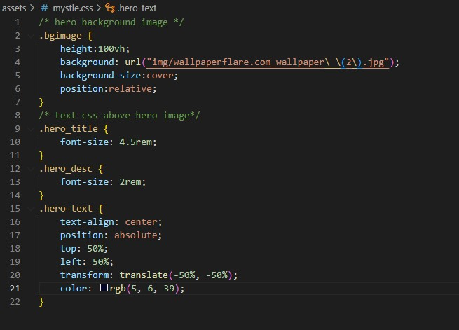
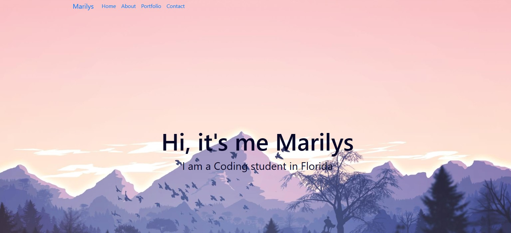
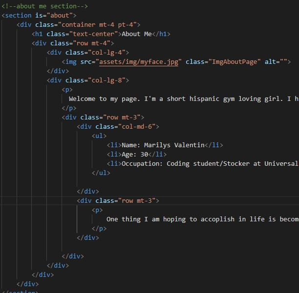
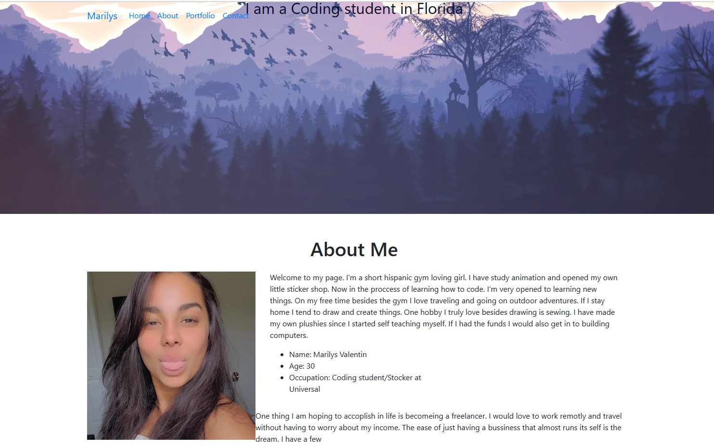

#CSS challenge: Professinal Protfolio

In this challenge we will be creating a website from scratch. Showing case who we are and what we do. 

##User Story 

```
AS AN employer
I WANT to view a potential employee's deployed portfolio of work samples
SO THAT I can review samples of their work and assess whether they're a good candidate for an open position
```

##Acceptance Criteria

```
GIVEN I need to sample a potential employee's previous work
WHEN I load their portfolio
THEN I am presented with the developer's name, a recent photo or avatar, and links to sections about them, their work, and how to contact them
WHEN I click one of the links in the navigation
THEN the UI scrolls to the corresponding section
WHEN I click on the link to the section about their work
THEN the UI scrolls to a section with titled images of the developer's applications
WHEN I am presented with the developer's first application
THEN that application's image should be larger in size than the others
WHEN I click on the images of the applications
THEN I am taken to that deployed application
WHEN I resize the page or view the site on various screens and devices
THEN I am presented with a responsive layout that adapts to my viewport
```
##Screen shots of my work flow.
```
Here we have added the nav bar and main banner to the  HTML file with the link to the CSS style sheet.
```


```
I have upadted the the CSS sheet, to mkae my HTML more Readable.
```

```
I am also useing a Bootcamp css to help stle my navbar this is how it looks so far
```

```
I have added class named mt-4 and pt-4 with a container class that will set the margin top and padding top to 1.5. The next section was assgined a class of col-lg-8 wiht like atke up the right column with an 8-part grid for bigger screens.
```



```
Here i was able to add a Section to show what I do under portfolio. As of right now I don't have much so I do have some empty boxes. 
