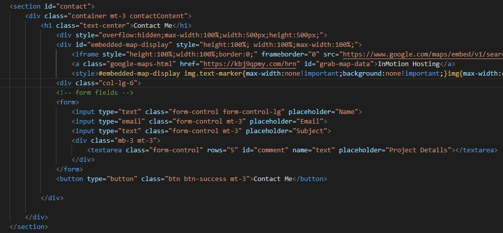

# CSS challenge: Professinal Protfolio

In this challenge we will be creating a website from scratch. Showing case who we are and what we do. 

## User Story 

```
AS AN employer
I WANT to view a potential employee's deployed portfolio of work samples
SO THAT I can review samples of their work and assess whether they're a good candidate for an open position
```

## Acceptance Criteria

```
GIVEN I need to sample a potential employee's previous work
WHEN I load their portfolio
THEN I am presented with the developer's name, a recent photo or avatar, and links to sections about them, their work, and how to contact them
WHEN I click one of the links in the navigation
THEN the UI scrolls to the corresponding section
WHEN I click on the link to the section about their work
THEN the UI scrolls to a section with titled images of the developer's applications
WHEN I am presented with the developer's first application
THEN that application's image should be larger in size than the others
WHEN I click on the images of the applications
THEN I am taken to that deployed application
WHEN I resize the page or view the site on various screens and devices
THEN I am presented with a responsive layout that adapts to my viewport
```
## Screen shots of my work flow.
```
Through out this I was using Bootstrap, whcih I linked in the html file.
Here we have added the nav bar and main banner to the  HTML file with the link to the CSS style sheet. First link is to help create the website. I then Have a second link to help me create my Footer whic You will see later on in the the readme file. 
```


```
I have upadted the the CSS sheet, to mkae my HTML more Readable.
```

```
I am also useing a Bootcamp css to help stle my navbar this is how it looks so far
```

```
I have added class named mt-4 and pt-4 with a container class that will set the margin top and padding top to 1.5. The next section was assgined a class of col-lg-8 with like take up the right column with an 8-part grid for bigger screens.
```


```
Here I was able to add a Section to show what I do under portfolio. As of right now I don't have much so I do have some empty boxes. 
* (later I change this section to Skills)
```


# Adding dark backround color to Navbar on page scroll
```
I wanted to have the Navbar a bit more noticable when scrolling though the wbesite so in my CSS file I added a backround color and changed the sizing. I also wanted to section of each pare with a diffent color backround and changed the color of the text.
```


# Added a map with Google maps (not my real loacation)
```
Here I wanted to try and add a map for future projects. I used  https://www.embed-map.com to Generate an HTML code which I then copy and pasted to my code locted in my contact section of my HTML file. 
```


# CHanging my Portfoli osection to read SKills and add a better Portfolio section.
```
Switch what I had for a portfolio to a skill section and then added a Portfolio section that shows what I have done in the past and what i'm curretly doing.
```


